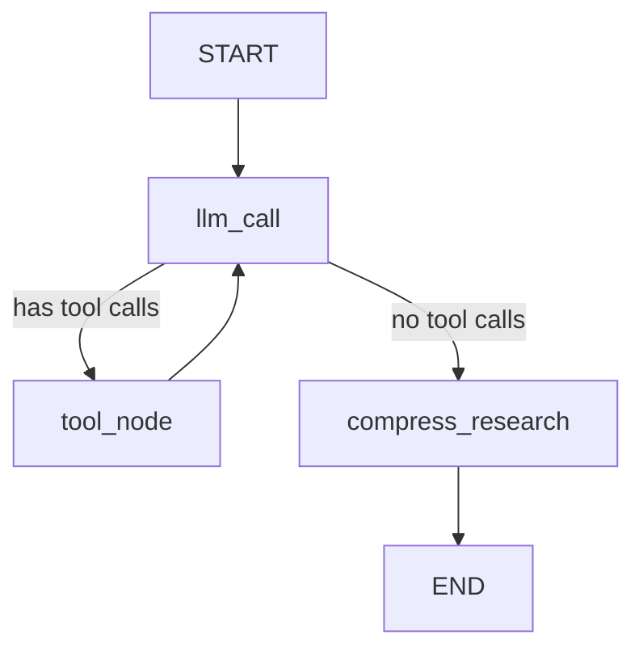

ReAct 循环是 LLM Agent 的核心运行模式：模型思考、调用工具、观察结果、再思考，如此往复直到任务完成。

## 一、什么是 ReAct 循环？

ReAct 的全称是 Reasoning + Acting。它的核心思想很简单：让大语言模型（LLM）在「思考」和「行动」之间交替进行，就像一个人边查资料边写报告一样。

整个循环可以概括为三步。

（1）LLM 分析当前状态，决定下一步行动（比如搜索某个关键词）。

（2）系统执行 LLM 要求的工具调用，把结果返回给 LLM。

（3）LLM 看到结果后，判断是否需要继续搜索，还是已经可以给出最终答案。

如果还需要继续，就回到第（1）步。整个过程就像一个 while 循环，退出条件是「LLM 不再请求任何工具调用」。

这篇文章对比两个项目中的 ReAct 实现：一个用 Python + LangGraph 的声明式状态机，另一个用 Go 的命令式 for 循环。它们在概念上完全等价，但写法截然不同。

## 二、项目背景

### `deep_research_from_scratch`

这是一个基于 LangGraph 的深度研究系统。它用 Python 编写，把整个研究流程拆成三个阶段：Scope（明确问题）、Research（执行研究）、Write（生成报告）。

其中 Research 阶段的核心就是一个 ReAct 循环，定义在 `research_agent.py` 中。

### `axe`

这是一个用 Go 编写的轻量级 CLI 工具，用来运行 LLM Agent。它没有使用任何框架，而是在 `cmd/run.go` 中用一个原生的 `for` 循环实现了同样的 ReAct 模式。

两者的关系可以用一个类比来理解：`deep_research` 就像用 React 框架写前端 —— 你声明组件和数据流，框架帮你执行；`axe` 就像用原生 JavaScript 手写 DOM 操作 —— 你自己控制每一步。

## 三、LangGraph 声明式实现

`deep_research` 使用 LangGraph 的 `StateGraph` 把 ReAct 循环表达为一张有向图。

下面是图的构建代码。

```python
# research_agent.py (L122-L144)

agent_builder = StateGraph(ResearcherState, output_schema=ResearcherOutputState)

agent_builder.add_node("llm_call", llm_call)
agent_builder.add_node("tool_node", tool_node)
agent_builder.add_node("compress_research", compress_research)

agent_builder.add_edge(START, "llm_call")
agent_builder.add_conditional_edges(
    "llm_call",
    should_continue,
    {
        "tool_node": "tool_node",
        "compress_research": "compress_research",
    },
)
agent_builder.add_edge("tool_node", "llm_call")
agent_builder.add_edge("compress_research", END)

researcher_agent = agent_builder.compile()
```

上面代码中，有三个关键点。

（1）`add_node` 注册了三个节点：`llm_call`（调用模型）、`tool_node`（执行工具）、`compress_research`（压缩研究结果）。

（2）`add_conditional_edges` 是循环的分支点。`should_continue` 函数检查 LLM 的最后一条消息是否包含工具调用：有则走 `tool_node`，无则走 `compress_research`。

（3）`add_edge("tool_node", "llm_call")` 这条边就是「循环回去」的意思 —— 工具执行完毕后，重新回到 LLM 节点进行下一轮思考。

用 Mermaid 画出来就是这样。



路由函数 `should_continue` 的逻辑非常简单。

```python
def should_continue(state: ResearcherState) -> Literal["tool_node", "compress_research"]:
    messages = state["researcher_messages"]
    last_message = messages[-1]
    if last_message.tool_calls:
        return "tool_node"
    return "compress_research"
```

上面代码中，判断条件只有一个：最后一条消息是否有 `tool_calls`。如果有，继续循环；如果没有，退出循环并压缩研究结果。

## 四、Go 命令式实现

`axe` 没有使用任何图框架，而是用一个 `for` 循环直接实现了同样的逻辑。

下面是核心循环代码。

```go
// cmd/run.go (L538-L621)

for turn := 0; turn < maxConversationTurns; turn++ {
    if tracker.Exceeded() {
        break
    }

    // LLM 调用
    resp, err = prov.Send(ctx, req)
    if err != nil {
        return mapProviderError(err)
    }

    tracker.Add(resp.InputTokens, resp.OutputTokens)

    // 退出条件：没有工具调用
    if len(resp.ToolCalls) == 0 {
        break
    }

    if tracker.Exceeded() {
        break
    }

    // 把助手消息追加到请求中
    assistantMsg := provider.Message{
        Role:      "assistant",
        Content:   resp.Content,
        ToolCalls: resp.ToolCalls,
    }
    req.Messages = append(req.Messages, assistantMsg)

    // 执行工具调用
    results := executeToolCalls(ctx, resp.ToolCalls, ...)

    // 把工具结果追加到请求中
    toolMsg := provider.Message{
        Role:        "tool",
        ToolResults: toolResults,
    }
    req.Messages = append(req.Messages, toolMsg)
}
```

上面代码中，循环的结构非常清晰。

（1）`prov.Send(ctx, req)` 对应 LangGraph 中的 `llm_call` 节点。

（2）`len(resp.ToolCalls) == 0` 这个 `break` 对应 `should_continue` 的路由判断。

（3）`executeToolCalls(...)` 对应 `tool_node` 节点。

（4）`req.Messages = append(...)` 就是手动管理状态 —— 在 LangGraph 中，这部分由 `add_messages` reducer 自动完成。

还有一个区别：`axe` 有一个硬性的 `maxConversationTurns` 上限（默认50轮），而 LangGraph 版本依赖 LLM 自行决定何时停止（通过 prompt 中的 Hard Limits 指令引导）。

## 五、逐项对比

下面是两种实现的关键差异。

| 维度 | `deep_research`（Python/LangGraph） | `axe`（Go） |
|------|--------------------------------------|-------------|
| 循环机制 | 声明式图：节点 + 边 + 条件路由 | 命令式 `for` 循环 + `break` |
| 退出条件 | `should_continue()` 返回 `"compress_research"` | `len(resp.ToolCalls) == 0` 触发 `break` |
| 工具执行 | 顺序执行（`for tool_call in tool_calls`） | 默认并行执行（`executeToolCalls`） |
| 状态管理 | `TypedDict` + `add_messages` reducer 自动合并 | 手动 `append` 到 `req.Messages` 切片 |
| 循环后处理 | `compress_research` 节点生成研究摘要 | 无 —— 直接返回原始对话 |
| 最大轮次 | 通过 prompt 软限制（5次搜索） | `maxConversationTurns` 硬限制（默认50） |
| Token 预算 | 无内置机制 | `tracker.Exceeded()` 双重检查 |

核心结论是：**两者在语义上完全等价**。图的 `tool_node -> llm_call` 边就是 `for` 循环的「下一轮迭代」；`should_continue` 就是 `break` 条件的取反。

## 六、CLAUDE.md 的作用

在对比这两个项目的过程中，我们还为 `deep_research_from_scratch` 仓库编写了 `CLAUDE.md` 文件。

`CLAUDE.md` 是 Claude Code 的项目级指令文件。它的作用是让 AI 助手在首次接触一个新仓库时，能快速理解项目的关键约束和工作流程，而不需要从零开始探索。

对于 `deep_research` 这个项目，`CLAUDE.md` 中最关键的一条规则是：

> Notebooks 是唯一的代码源。`src/` 下的 Python 文件由 `%%writefile` magic 生成，不要直接编辑。

这条规则如果不写在 `CLAUDE.md` 里，AI 助手很可能会直接去修改 `src/` 下的文件，导致下次运行 notebook 时更改被覆盖。

## 七、源码出处

| 项目 | 值 |
|------|-----|
| 仓库 | [deep_research_from_scratch](https://github.com/langchain-ai/deep_research_from_scratch)（fork） |
| 文件 | `src/deep_research_from_scratch/research_agent.py` |
| 分支 | `main` |

| 项目 | 值 |
|------|-----|
| 仓库 | axe（本地） |
| 文件 | `cmd/run.go` |
| 分支 | `main` |

## 八、参考链接

- [ReAct: Synergizing Reasoning and Acting in Language Models](https://arxiv.org/abs/2210.03629)
- [LangGraph Documentation](https://langchain-ai.github.io/langgraph/)
- [LangGraph ReAct Agent Tutorial](https://langchain-ai.github.io/langgraph/tutorials/workflows/#agent)
- [Claude Code CLAUDE.md Reference](https://docs.anthropic.com/en/docs/claude-code/memory#claudemd)
